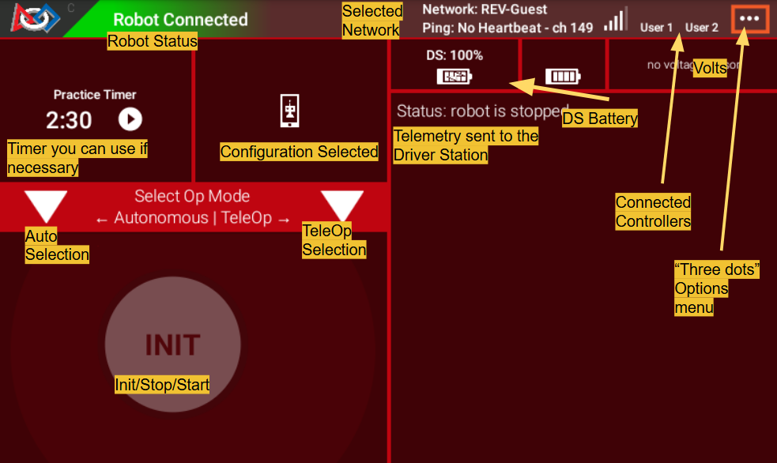

# Driver Station Walkthrough

The driver station is the app that you will use to control your robot. It is a very important part of the robot, as it allows you to control the robot and see the telemetry from the robot.

## What is the Driver Station?

It is an android device that connects to the robot control hub via and allows you to control the robot with gamepads. It also reports telemetry so you can see potential errors with your bot.

