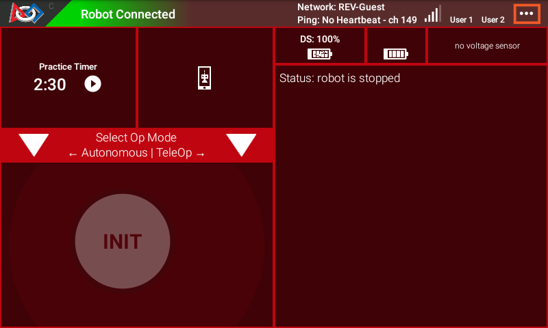

# OpMode

The OpMode is what is run in your code, this can be either `@TeleOp` or `@Autonomous`.

The OpMode is where all your code goes, it includes functions such as the following in order to aid you in the process of coding:

```java
waitForStart() //must be called before your while loop
runOpMode() // usually is right after variables to tell the robot what code it needs to run
loop() // a less commonly used function that does the same thing as while(opModeIsActive()){}
init() // is run during robot in init
opModeIsActive() // returns a boolean if the opMode is running or not
opModeInInit() //returns a boolean if the opMode is currently in the init state
requestOpModeStop() // requests the opMode to stop
isStarted() // returns if the robot is started or not
isStopRequested() // returns if stop button has been pressed or not
```

#### TeleOp

Here is the [FTC BasicOpMode (24-25)](https://github.com/FIRST-Tech-Challenge/FtcRobotController/blob/master/FtcRobotController/src/main/java/org/firstinspires/ftc/robotcontroller/external/samples/BasicOmniOpMode_Linear.java) it uses 2 motors. In the [blank TeleOp Example](exampleTeleOpBlank.md) you will find that there are 20 lines

```java
//imports
@TeleOp(name="exampleTeleOpBlank",group="Pushbot")
//@Disabled
public class exampleTeleOpBlank extends LinearOpMode {
    HardwarePushbot robot = new HardwarePushbot();
    private ElapsedTime   runtime = new ElapsedTime();
    @Override
    public void runOpMode(){
        runtime.reset();
        getRuntime();
        waitForStart();
        while (opModeIsActive()){
            getRuntime();
            telemetry.addData("Time:", String.valueOf(runtime));
        }
    }
}
```

First, comments are indicated by `//`

Imports are how you get the references and all the different pieces to the code.

Next we have `@TeleOp(name="exampleTeleOpBlank",group="Pushbot")`, this means that this opmode is being classified under the teleOp section, with the name "exampleTeleOpBlank" and it is being placed in the Push-bot group

Now we have the `public class exampleTeleOpBlank extends LinearOpMode{` this means that this opmode can now be used as a base opmode, extending an opmode means that all variables and functions are shared between the opModes. In this case the file is extending the Linear Op Mode file which you will be able to find in your forked repository.

Next we have our `HardwarePushbot robot = new HardwarePushbot();` and `private ElapsedTime runtime = new ElapsedTime();` the first part declares the robot as a robot, we will be using push-bot software for the season. Elapsed time is a very important thing to consider, it times the round as it is going. You can use this for a lot of things including having an endgame timer and restricting your auto time to 30 seconds.

Next we have the function `public void runOpMode(){` this runs when you press Init it will run that part. Remember, when you hit Init, it is not running the whole program yet, just the small part in between runOpMode and opModeIsActive.

Now we will run `runtime.reset();` and `getRuntime()`, these are required in order for your runtime to be correct.

`waitForStart();` tells the opmode to wait until the user presses go, when this happens, everything inside this function runs.

`telemetry.addData("Time:", String.valueOf(runtime));`, telemetry is your equivalent of printing data in python and other languages, using this will print onto your phone, "Time: 60(or what the time is).

#### Autonomous

In the [Blank Autonomous Example](exampleAutoBlank.md) you will find 18 lines.

```java
//imports
@Autonomous(name="exampleAutoBlank", group="Autonomous")
//@Disabled
public class exampleAutoBlank extends exampleTeleOpBlank {  //your doc name *extends* your main code branch
    private ElapsedTime   runtime = new ElapsedTime();
    @Override
    public void runOpMode(){
        runtime.reset();
        getRuntime();
        waitForStart();
        //actual code
        while (getRuntime()<=30) {
            getRuntime();
            telemetry.addData(String.valueOf(runtime), "Working");
        }
    }
}
```

Imports are how you get the references and all the different pieces to the code.

Next we have `@TeleOp(name="exampleAutoBlank",group="Autonomous")`, this means that this opmode is being classified under the autonomous section, with the name "exampleAutoBlank" and it is being placed in the autonomous group

Now we have the `public class exampleAutoBlank extends exampleTeleOpBlank{` this means that this opmode can now be used as a secondary opmode. In this case the file is extending the exampleTeleOpBlank file.

Now we don't have to use `HardwarePushbot robot = new HardwarePushbot();` because it has been shared through extension, but we have to do `private ElapsedTime runtime = new ElapsedTime();` because it is private.

Next we have the function `public void runOpMode(){` this runs when you press Init it will run that part. Remember, when you hit Init, it is not running the whole program yet, just the small part in between runOpMode and opModeIsActive.

Now we will run `runtime.reset();` and `getRuntime()`, these are required in order for your runtime to be correct.

`waitForStart();` tells the opmode to wait until the user presses go, when this happens, everything inside this function runs.

```java
while (getRuntime()<=30) {
       getRuntime();
       telemetry.addData(String.valueOf(runtime), "Working");
  } 
```

This gets the runtime, checks it and if it is less than or equal to 30 seconds, it keeps running. If it is over or equal to 30, it stops.



This shows the TeleOp on the right side of Select OpMode, the autonomous on the left

To the right of that, the telemetry would be shown if you had any telemetry data running.

