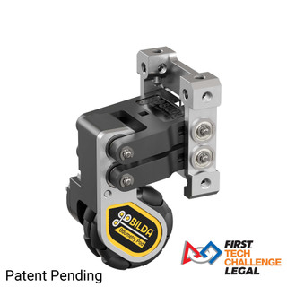

# Encoders

Encoders are very accurate measurement systems that rely on the wheel movements to measure distances.

## How do they work? 


Most of them work by having a light on one side of the encoder disk. On the other side of the disk there is usually a receiver. On the encoder disk there are a bunch of holes, this is the encoder ticks per revolution, and you should be able to find this where you ordered the motor you are using. Most of the motors available for FTC have encoders built into them.


## How do you use them? 

Translating ticks to inches is a very simple process, you simply need ticks/rev and circumference of the wheel. This is found with the below code:

```java
static final double COUNTS_PER_MOTOR_REV = your specific encoder counts per revolution;
static final double WHEEL_DIAMETER_MM = your wheel diameter in mm;
static final double WHEEL_DIAMETER_INCHES = WHEEL_DIAMETER_MM * 0.0393701;     // For figuring circumference
static final double COUNTS_PER_INCH = (COUNTS_PER_MOTOR_REV * your gear ratio) /
            (WHEEL_DIAMETER_INCHES * 3.1415);//gets the overall counts per inch to help with encoders
```

These calculations are the exact calculations that you should use to calculate the counts per inch of the encoder. `.setMode(DcMotor.RunMode.STOP_AND_RESET_ENCODER);` This run mode will stop and reset the encoder to 0 ticks. `.setMode(DcMotor.RunMode.RUN_USING_ENCODER);` This run mode will make it start to track the encoder position. `newLeftTarget = motorBackLeft.getCurrentPosition() + (int) (leftInches * COUNTS_PER_INCH);` This sets a new target by setting a target position based on the current position. `.setTargetPosition(newLeftTarget);` `.setMode(DcMotor.RunMode.RUN_TO_POSITION);` This sets the target position of the motor to the target we just got above. It will also run the motor to the position. After that use the method `.setPower(1);` to set the power of the motor.

```java
while (opModeIsActive() &&
   (runtime.seconds() < timeout) &&  //timeout is used to make sure it doesn't run for too long 
   (motor.isBusy())) {

   // Display it for the driver.
   telemetry.addData("Running to", newLeftTarget);
   telemetry.addData("Currently at", motor.getCurrentPosition());
   telemetry.update();
}
```

This will make sure it doesn't stop before going the distance it needs to. After this `.setPower(0);` will make the robot and wheels stop. You need to do `.setMode(DcMotor.RunMode.RUN_USING_ENCODER);` again to make turn off run to position.

## Why should you use them?

You should use them because they are very helpful to go to an exact distance.

## Some example encoders

**Rev Through Bore**


**GoBilda Swingarm**


**GoBilda 4 Bar**


