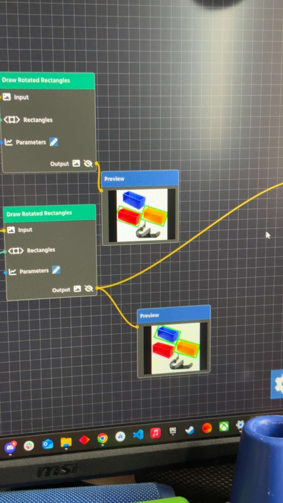

# Resources

## Learning Java

[Learn Java For FTC](https://github.com/alan412/LearnJavaForFTC/blob/master/LearnJavaForFTC.pdf)

[Game Manual 0](https://gm0.org/)

[CtrlAltFTC](https://www.ctrlaltftc.com/)

[https://cookbook.dairy.foundation/introduction.html](https://cookbook.dairy.foundation/introduction.html)

[https://ftc-resources.readthedocs.io/en/latest/index.html](https://ftc-resources.readthedocs.io/en/latest/index.html)

## QuickStarts

[Mecanum Drivetrain QuickStart](https://gm0.org/en/latest/docs/software/tutorials/mecanum-drive.html)

[TankDrive Drivetrain Quickstart](https://docs.revrobotics.com/ftc-kickoff-concepts/freight-frenzy-2021-2022/programming-teleoperated)

## PID

[https://youtu.be/E6H6Nqe6qJo?si=luVu2EeaFapRfCl3](https://youtu.be/E6H6Nqe6qJo?si=luVu2EeaFapRfCl3)

[https://cookbook.dairy.foundation/pidf_controllers/integrating_a_custom_PIDF_controller.html?highlight=custom%20pidf#creating-a-pidf-controller](https://cookbook.dairy.foundation/pidf_controllers/integrating_a_custom_PIDF_controller.html?highlight=custom%20pidf#creating-a-pidf-controller)

## Vision

[https://docs.deltacv.org/eocv-sim](https://docs.deltacv.org/eocv-sim)

[https://docs.deltacv.org/papervision](https://docs.deltacv.org/papervision)

## Other Useful Links

FTC Official GitHub [user page](https://github.com/FIRST-Tech-Challenge)

[Rev Hardware Client](https://docs.revrobotics.com/rev-hardware-client/getting-started/installation-instructions)

[FTC Resource Library](https://www.firstinspires.org/resource-library/ftc/game-and-season-info)
