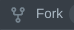
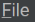
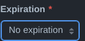

# Getting Started

### Basic Steps

To get started with Github, Android Studio, and Java Programming, you will need to follow these steps:

1. Create a Github account if you haven't already
2. Fork the [FTC Robot Controller](https://github.com/FIRST-Tech-Challenge/FtcRobotController) repository, look at [this](githubbasics.md#fork) for help and more info
3. Download Android Studio, instructions [here](githubbasics.md#setup)
4. Clone your forked repository, instructions [here](githubbasics.md#clone)
5. Open the project in Android Studio
6. Code
7. Send the robot your updated code
8. Setup a config on your robot
9. Start controlling your robot!

### Android Studio Tutorial 

#### Android Studio Setup 

Android Studio Setup Video Tutorial:



***

Android studio is one of the more intuitive IDE's I have encountered. There are a lot of things that you can get lost with easily though.

**Gradle** - The gradle is the way your app (robot) will run

**ADB** - Android Debug Bridge is the way your computer will connect to the control hub and build the application

#### How does everything work?

* Basically, when you hit upload, it runs and installs an app to the robot's control hub. What this does is allow it to run effectively while connected to the driver station. The **gradle** is the way that this app gets built. This is also why it is so important to fork the FTC Robot Controller. They make the onboarding steps so much easier just because all of the work for setup is done for you.

#### Plugins

I have encountered a bunch of plugins for AS that make the experience so much better. None of these are mandatory but may improve your experience. You access this page in the settings for AS.

* ADB Idea - Allows you to effectively use ADB with your computer to make sure everything is working properly.
* Better Comments - Changes your comments to different colors with different tags. This is extremely beneficial because it catches your eye more so you can leave notes for yourself.
* CodeGlance Pro - This improves the normal sidebar you will see when scrolling, it shows you the color of all of your code so you can easily see where you might need to be looking.
* Discord Integration - Definitely not necessary but very fun to use and show everyone which project you are working on in Discord.
* Dracula Theme - My personal favorite theme for AS because it looks very nice and the color coding makes a lot of sense to me.
* GitHub Copilot - A very useful companion when you are coding. It is a **subscription** that you can get free with GitHub Student Developer but basically allows you to have an AI "copilot" built in to your IDE for code completion and general help.
* SonarLint - This is a very nice "linting" or code checking software that can provide helpful resources to tell you where something might be broken, or when you aren't following proper programming practices.
* Star Wars Progress Bar - My personal favorite plugin I have. All it really does is change your progress bars to Star Wars ships. It adds a lot of fun to the IDE.

### Setting up Git 

In order to setup your repository correctly you will do 2 things. 1.Fork and 2. Clone this will get the repository to your github account and then put that repository local on your computer. Remember **only one person will need to fork the repo** then you will share it to the rest of your team. You will go through  and to **collaborators** then add your team members using the add people button.

#### Forking 

Go to this [website](https://github.com/FIRST-Tech-Challenge/FtcRobotController) and find the latest repository from the company. Press the  button. This will "copy" the repository onto your github account. Remember **only one person will need to fork the repo per team**!

#### Cloning the repository 

To clone the repository, first find it on your github profile. You have 2 options on what to do you can do it through android studio or through github. **Everyone on a team will need to do this!!**

Android Studio: Tap , then  , . Go back to your repository and copy the url, paste it into the box and make sure the destination is desktop. You might need to have an access token to do this.

Github: Navigate to the repository you want to clone. Tap  then select . This will download it to your computer. Extract the zip file (double click) and move it to desktop. Then, go back to Android Studio. Tap  then  and select the path where the folder is (desktop).

### Github basics 

Github is organized in a few sections. One, the code section, this is where your code and files are stored. Your repositories, where all of your code is stored and your profile, where all of your repositories are stored.

#### Commits 

Committing is an essential part in every part of coding while connected to github, it makes sure you have the latest edited version of your code local on your computer, we got the code local to the computer in cloning. In a github file it is a green rectangular button at the bottom of the file that says commit changes,  when committing directly from github it strictly gives the code to github, you will not have the code local yet. To make your code local you will need to pull in your code app, most likely android studio. In android studio, the commit button is a check mark in your top right corner. You are also allowed to commit and push, to be explained later in push. You will also need a commit message to be able to push the commit.

#### Push 

* What is a push?
  * A push will essentially do exactly as it says, push the code to github. This makes sure that you not only have the latest version of code locally, but also sent to github through the cloud. This is essential for working on code together as a team and collaborating. The push button is the arrow next to the commit button, it will be pointing out, where you want the code to go. Commit and push does both at the same time to simplify the process. Also see pull/merge

#### Pull/merge 

* What is a pull?
  * A pull is the exact opposite of a push. It will take the current version of the code directly from github and sync it locally to your device/coding app. This is also essential as it allows you to get the teams latest version of code. This is helpful when multiple people are working on code all at once. If you are pushing sometimes it will ask you to merge your current code, this means you don't have the latest version, not to worry though as if you say yes github will automatically merge and add your code to the latest code. The pull button is an arrow pointing in, or towards your computer. 

#### Managing your server 

Managing a server is really not that hard if you do it correctly from the start. There is a settings  button in your repository, in this tab you will find a bunch of options, it is better if you don't mess with anything that you don't know what it does. In the collaborator tab you will need to add @stcline (if you are a part of WHS). Other than that there are really no settings you need to mess with except maybe email notifications if you would like that.

#### Personal Access Token 

In github, tap on your profile ( top right corner ), then:

1. 
2. 
3. 
4. 
5. 
6.  ( Select all, it will work better that way )

#### Video Explanation of GitHub 


